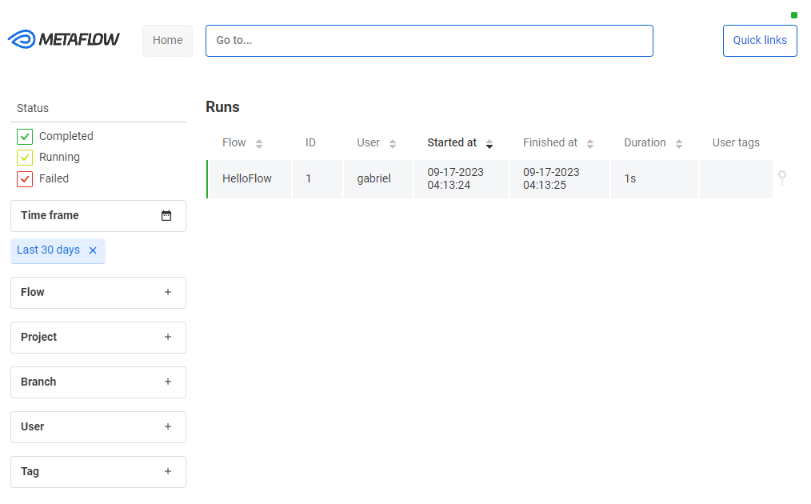

# metaflow-docker-deployment
Latest version of Metaflow Service and a Metaflow UI to inspect Flow's metadata and results. See [why Metaflow](https://docs.metaflow.org/introduction/why-metaflow).  

## Local Deployment
Run the compose file to up Metaflow UI, metadata/migration service and database:
```console
$ docker-compose -f docker-compose-metaflow.yml up -d
```
You should be able to find that
* Metaflow UI service is available at `localhost:8083`.
* Metaflow metadata service is available at `localhost:8081`;
* Metaflow migration service is available at `localhost:8082`;
* Metaflow database (postgresql) is available at `localhost:5432`.

Wait a few seconds and verify that everything is working as expected by visually inspecting the [Metaflow UI](localhost:8083) or pinging containers:
```console
curl -v localhost:8081/ping localhost:8082/ping localhost:8083/ping
```
  
To shut everything down, remember to run:
```console
docker-compose -f docker-compose-metaflow.yml down
```