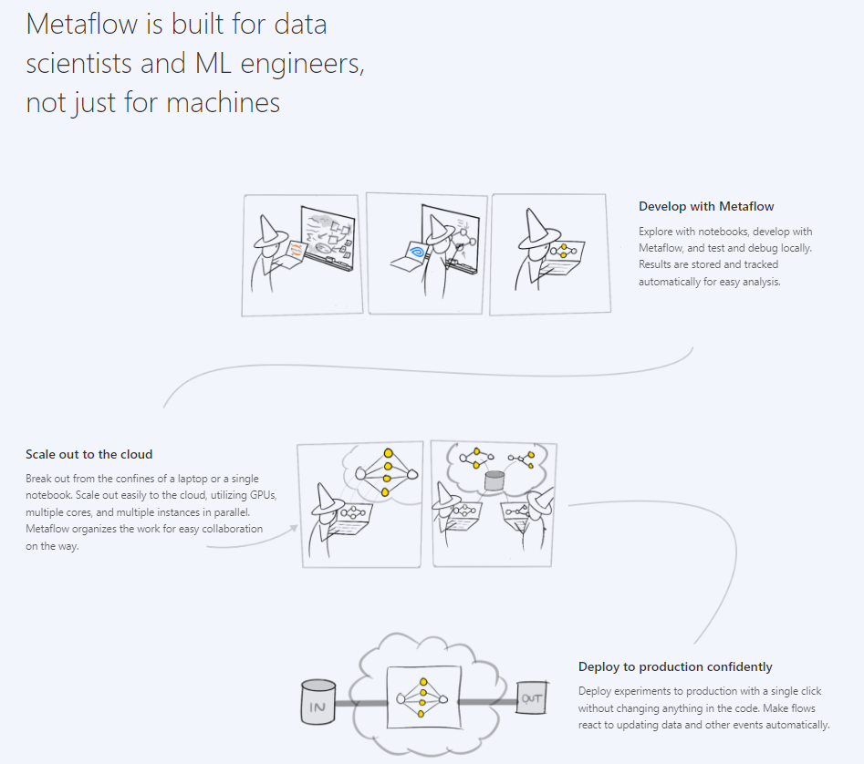

# metaflow-docker-deployment
Fully functional Metaflow metadata service, UI and datastore deployment with docker and docker-compose. See [why Metaflow](https://docs.metaflow.org/introduction/why-metaflow).  
  
*Image by https://metaflow.org/*
## Usage
First of all, make sure you have the following: `python3`, `python3-venv`, `make`, `docker` and `docker-compose`.  
### Up the containers
Run the compose file to bring up Metaflow UI, metadata/migration service, database and datastore:
```console
$ docker-compose -f docker-compose-metaflow.yml up -d
```
You should be able to find that
* Metaflow UI service is available at `localhost:8083`
* Metaflow metadata service is available at `localhost:8081`
* Metaflow migration service is available at `localhost:8082`
* Metaflow database (postgresql) is available at `localhost:10000`
* Metaflow datastore (minio) console is available at `localhost:10001`
* Metaflow datastore (minio) S3 API is available at `localhost:10002`
### Configure metaflow
When running flows, metaflow will look for profile configurations at `~./metaflowconfig`. Let's create a new `METAFLOW_PROFILE` called `local` there, configured to use our recently deployed stack:
```console
$ bash add_metaflow_config_local.sh
```
### To verify that everything is working
Create a virtual environment with `metaflow` by running:
```console
$ make install
```
Activate `.venv`:
```console
$ source .venv/bin/activate
```
Now you can try running the `hello_flow.py` with the `local` profile. Note that we need to provide AWS access and secret keys, because metaflow will need them to connect to S3 (local minio in our case) via `boto3`:  
```console
$ METAFLOW_PROFILE=local AWS_ACCESS_KEY_ID=dummy_access_key AWS_SECRET_ACCESS_KEY=dummy_secret_key python hello_flow.py run
```
Visually inspect the results in the [Metaflow UI](localhost:8083):  
  
Search for artifacts in the [Metaflow Datastore Bucket](localhost:10001) (user: `dummy_access_key`, pass: `dummy_secret_key`):  
  
Ping containers:
```console
$ curl -v localhost:8081/ping localhost:8082/ping localhost:8083/ping
```
### Terminating
To shut everything down, remember to run:
```console
$ docker-compose -f docker-compose-metaflow.yml down
```